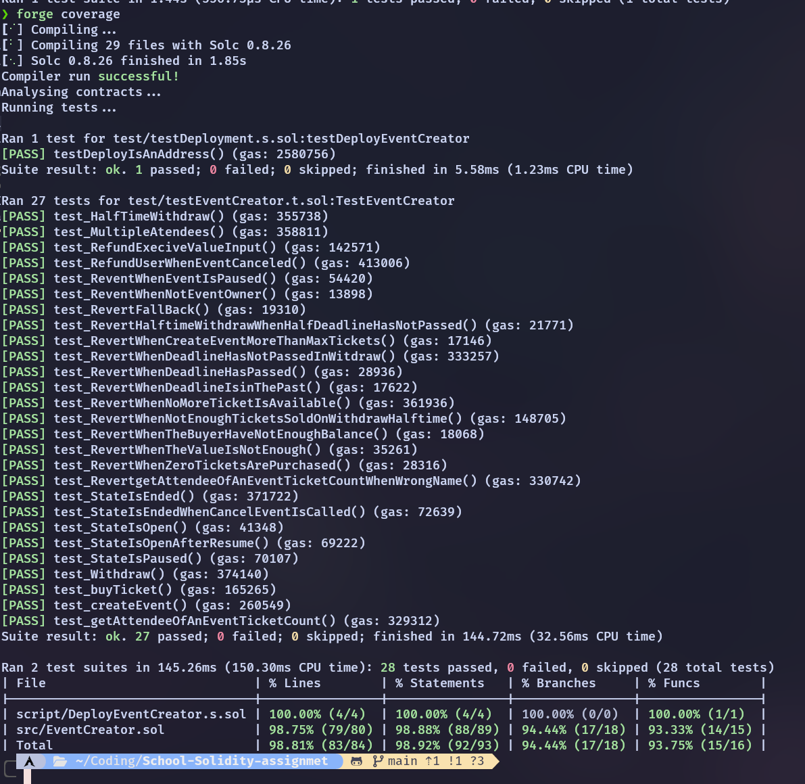

# School assignment in solidity --> Carl Klöfverskjöld
## EventCreator contract
The `EventCreator` contract is a Solidity contract that allows users to create, manage, and participate in events. It's designed to handle events with a maximum of 65,000 tickets.

## Key Features

1. **Event Creation**: Users can create an event by providing details such as the event name, description, location, ticket price, total tickets, deadline, and minimum tickets required for the event to take place.

2. **Ticket Purchase**: Users can buy tickets for an event. The contract ensures that the event is open, has not ended, and has enough tickets available. It also checks that the user has sufficient funds and has sent enough Ether to cover the cost of the tickets.

3. **Event Management**: The owner of an event can pause, resume, or cancel the event. If an event is cancelled, all attendees are refunded.

4. **Withdraw Funds**: The owner of an event can withdraw the funds collected from ticket sales. This can be done either at the end of the event or at the halfway point if the minimum number of tickets has been sold.

5. **Fallback Function**: The contract includes a fallback function that reverts any transactions that don't match the available functions, preventing Ether from being sent to the contract without a function call.

## Coverage 

If you look att this [coverage report](./coverage.txt) you can see what line of code that is not covered by the tests.

### Requirment for VG:
- [x] A constructor
- [x] Atleast: 1 custom error, one require, one assert, one revert, event, and modifier
- [x] Have a falback function
- [x] Identify and implement atleast three gasoptimzing solution with an explaination.
- [x] Distrubute and verify the contract on etherscan. And provide a link 
- [x] Atleast test coverage of 90%

### Gasoptimzing solutions
1. **Use of `view` and `pure` functions**: Functions that don't modify the state of the contract should be declared as `view` or `pure` to save gas. This tells the compiler that the function doesn't modify the state and can be executed locally without sending a transaction to the blockchain. This can save gas by avoiding the cost of writing data to the blockchain.

2. **Use of `++i` instead of `i++`**: In Solidity, using `++i` instead of `i++` can save gas. When you use `i++`, the value of `i` is first read, then incremented, and then written back to storage. This requires an additional read and write operation, which can cost more gas. On the other hand, `++i` increments the value of `i` and returns the new value without the additional read and write operations.

3. **Use of `if and revert` instead of `Require` and `assert`**: Using `if` statements with `revert` can save gas compared to using `require` and `assert`. The `require` and `assert` statements are more expensive in terms of gas because they perform additional checks and consume more gas. By using `if` statements with `revert`, you can achieve the same functionality with less gas. 

4. **Use of public functions**: is used sparingly, as they are more expensive in terms of gas compared to external and internal functions. Public functions include additional logic to handle the input arguments and return values, which can increase the gas cost. By using external and internal functions where possible, you can save gas.
